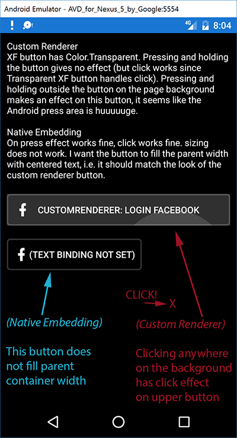

# xfdemo
Sample Xamarin.Forms applications with various problems/questions (and examples)

# Description (October 10th 2016)
The sample renders two buttons, the idea is that both look and work in the same matter but I'm fine
if at least one of them works as expected. The first button is using a *custom renderer* and the
second is using *native embedding*.

## Custom renderer
MainPage.xaml declares `<controlscustom:ImageButton ...` which inherits Xamarin.Forms.Button. The
first thing that custom implementation does is to set BackgroundColor to Color.Transparent to
prevent it from rendering any background. The text is however rendered from the XF.Button.
The .Droid project exports a renderer (ButtonRenderer) that applies a background (drawable xml) and
inserts an image (facebook logo). Yes - I am aware that the XF.Button supports images but when using
an image, the centered text in the button get offset by the image width, which makes the text not
purely centered. By rendering the image from the .Droid custom renderer the XF.Button text remains
centered.

### What works
* The overall look is correct
* The click event works
* Sizing is correctly based on the xaml layout containers

### Problems
1. No click effect (Android Material Ripple effect) on the button.
I assume this is because the XF button (though Transparent) still picks up the click event. I would
like to have the press effect from the custom rendered background - is that possible?
2. Click effect on the button when **pressing outside of the button**
When clicking/pressing and holding anywhere on the page background or the label text, then this
button has an onpress effect. It seems like the click area from the .Droid custom renderer is huge!
How can I limit this size?

## Native embedding
MainPage.xaml declares `<controlsnative:NativeImageButton ...` which inherits from
Xamarin.Forms.AbsoluteLayout (not button). It resolves a native embedded renderer using
`DependencyService.Get<INativeImageButton>()` and adds it to it's own layout. The .Droid project
handles rendering of the entire button (background, facebook logo and text).

### What works
* The overall look is correct (even if the element size is wrong)
* The click event works
* Click effect (Android Material Ripple effect) works correctly on the button

### Problems
1. The element is autosized and not covering the window width (as specified from the xaml layout)
I can achieve that the element covers the entire size by setting the buttons WidthRequest to 360f
but I do not want to set an absolute value. I would like for the button to fill it's parent
container (i.e. the PCL projects NativeImageButton - which is an AbsoluteLayout).

2. Centered text on the button
This can be a non issue if the sizing problem is solved. But if I set the WidthRequest to 360f,
then the button fills the entire width but the text is still not centered.

3. Binding timings/life cycle
I have BindableProperties for Text/Icon/TapCommand. I am currently creating the native view in the
constructor, before the bindable properties are set from the .xaml view. When creating the button,
the Text property is an empty string.
I could solve this by listening to propertyChanged for the Text property and when it changes I would
send the new Text to the native element and updating it's text.
But could/should I create the element at a later point in the PCL project and NativeImageButton?

## Screenshot describing the two major problems:
